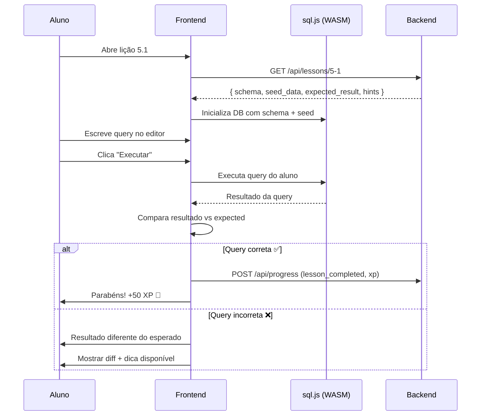

# 🗄️ SQL Quest — Plataforma de Prática com SQL

> Plataforma interativa e gamificada para aprendizado de SQL, inspirada no [Boot.dev](https://boot.dev).
> Foco 100% em **prática hands-on** — o aluno aprende escrevendo queries, não assistindo vídeos.

---

## 📌 Visão Geral

A **SQL Quest** é uma plataforma web onde o usuário progride por capítulos e lições resolvendo desafios de SQL diretamente no navegador. Cada lição apresenta um cenário com tabelas pré-populadas, um objetivo claro e um editor SQL integrado. O aluno escreve a query, executa, e o sistema valida automaticamente o resultado.

### Princípios

| Princípio | Descrição |
|---|---|
| **Prática acima de teoria** | Cada conceito é ensinado com exercícios práticos imediatos |
| **Luta produtiva** | Dificuldade gradual que desafia sem frustrar |
| **Feedback instantâneo** | Execução e validação em tempo real no browser |
| **Gamificação** | XP, streaks, conquistas e rankings para manter engajamento |
| **Currículo estruturado** | Progressão linear com desbloqueio de capítulos |

---

## 🎮 Features Principais

### 1. Editor SQL no Browser
- Editor de código com syntax highlighting (CodeMirror / Monaco Editor)
- Autocomplete para palavras-chave SQL, tabelas e colunas
- Execução de queries em tempo real usando **SQLite via WebAssembly (sql.js)**
- Sem necessidade de instalar banco de dados local

### 2. Sistema de Lições
- Cada lição contém:
  - 📖 **Explicação breve** do conceito (texto + exemplos)
  - 🎯 **Objetivo** — o que a query deve retornar
  - 📊 **Schema visual** — diagrama das tabelas disponíveis
  - ✏️ **Editor** — onde o aluno escreve a query
  - ✅ **Validação** — comparação do resultado com o esperado
  - 💡 **Dicas** — liberadas progressivamente se o aluno travar

### 3. Gamificação
- **XP (Experiência):** Ganhos por lição concluída, bonus por acertar de primeira
- **Streaks:** Dias consecutivos de prática
- **Conquistas/Badges:** Marcos especiais (ex: "Primeira JOIN", "100 queries executadas")
- **Ranking:** Leaderboard semanal entre usuários
- **Nível do Perfil:** Evolução visual do avatar/perfil

### 4. Assistente IA (Mentor SQL)
- Chatbot integrado usando abordagem **Socrática**
- Não dá respostas diretas — guia o aluno com perguntas
- Analisa a query do aluno e aponta onde está o erro lógico
- Sugere caminhos de investigação

### 5. Sandbox Livre
- Área de prática livre onde o aluno pode:
  - Criar suas próprias tabelas
  - Importar datasets (CSV)
  - Experimentar queries sem restrições
  - Salvar e compartilhar snippets

---

## 📚 Currículo — Capítulos e Lições

### Capítulo 1: Introdução ao SQL
> Entendendo o que é SQL, bancos de dados e tabelas

| # | Lição | Conceito |
|---|---|---|
| 1.1 | O que é um Banco de Dados? | Conceitos fundamentais |
| 1.2 | Sua Primeira Query | `SELECT * FROM tabela` |
| 1.3 | Selecionando Colunas | `SELECT col1, col2` |
| 1.4 | Alias de Colunas | `AS` |
| 1.5 | Comentários em SQL | `--` e `/* */` |

---

### Capítulo 2: Criando Tabelas
> Estruturando dados do zero

| # | Lição | Conceito |
|---|---|---|
| 2.1 | CREATE TABLE | Sintaxe básica |
| 2.2 | Tipos de Dados | `INTEGER`, `TEXT`, `REAL`, `BLOB` |
| 2.3 | Valores Padrão | `DEFAULT` |
| 2.4 | Deletando Tabelas | `DROP TABLE` |
| 2.5 | Alterando Tabelas | `ALTER TABLE` |

---

### Capítulo 3: Constraints (Restrições)
> Garantindo integridade dos dados

| # | Lição | Conceito |
|---|---|---|
| 3.1 | NOT NULL | Campos obrigatórios |
| 3.2 | UNIQUE | Valores únicos |
| 3.3 | PRIMARY KEY | Identificador único |
| 3.4 | FOREIGN KEY | Relacionamentos entre tabelas |
| 3.5 | CHECK | Validações customizadas |
| 3.6 | AUTOINCREMENT | IDs automáticos |

---

### Capítulo 4: CRUD — Manipulação de Dados
> Create, Read, Update, Delete

| # | Lição | Conceito |
|---|---|---|
| 4.1 | INSERT INTO | Inserindo registros |
| 4.2 | INSERT Múltiplo | Vários registros de uma vez |
| 4.3 | UPDATE | Atualizando dados |
| 4.4 | DELETE | Removendo registros |
| 4.5 | UPSERT | `INSERT OR REPLACE` |

---

### Capítulo 5: Consultas Básicas
> Filtrando e buscando dados

| # | Lição | Conceito |
|---|---|---|
| 5.1 | WHERE | Filtrando resultados |
| 5.2 | Operadores de Comparação | `=`, `!=`, `<`, `>`, `<=`, `>=` |
| 5.3 | AND / OR | Combinando condições |
| 5.4 | IN | Lista de valores |
| 5.5 | BETWEEN | Intervalos |
| 5.6 | LIKE | Busca por padrão |
| 5.7 | IS NULL / IS NOT NULL | Tratando valores nulos |
| 5.8 | DISTINCT | Valores únicos |

---

### Capítulo 6: Ordenação e Limitação
> Estruturando resultados

| # | Lição | Conceito |
|---|---|---|
| 6.1 | ORDER BY | Ordenação ascendente/descendente |
| 6.2 | LIMIT | Limitando resultados |
| 6.3 | OFFSET | Paginação |
| 6.4 | CASE WHEN | Lógica condicional |

---

### Capítulo 7: Funções de Agregação
> Calculando sobre conjuntos de dados

| # | Lição | Conceito |
|---|---|---|
| 7.1 | COUNT | Contando registros |
| 7.2 | SUM | Somando valores |
| 7.3 | AVG | Média |
| 7.4 | MIN / MAX | Mínimo e máximo |
| 7.5 | GROUP BY | Agrupando resultados |
| 7.6 | HAVING | Filtrando grupos |

---

### Capítulo 8: Subqueries
> Queries dentro de queries

| # | Lição | Conceito |
|---|---|---|
| 8.1 | Subquery no WHERE | Filtro dinâmico |
| 8.2 | Subquery no FROM | Tabelas derivadas |
| 8.3 | Subquery no SELECT | Colunas calculadas |
| 8.4 | EXISTS / NOT EXISTS | Verificação de existência |
| 8.5 | Subqueries Correlacionadas | Referência à query externa |

---

### Capítulo 9: Normalização
> Organizando dados de forma eficiente

| # | Lição | Conceito |
|---|---|---|
| 9.1 | O que é Normalização? | Conceito e importância |
| 9.2 | 1ª Forma Normal (1NF) | Atomicidade |
| 9.3 | 2ª Forma Normal (2NF) | Dependência funcional |
| 9.4 | 3ª Forma Normal (3NF) | Dependência transitiva |
| 9.5 | Desnormalização | Quando quebrar as regras |

---

### Capítulo 10: JOINs
> Combinando dados de múltiplas tabelas

| # | Lição | Conceito |
|---|---|---|
| 10.1 | INNER JOIN | Interseção de tabelas |
| 10.2 | LEFT JOIN | Todos da esquerda + matches |
| 10.3 | RIGHT JOIN | Todos da direita + matches |
| 10.4 | FULL OUTER JOIN | União completa |
| 10.5 | CROSS JOIN | Produto cartesiano |
| 10.6 | SELF JOIN | Tabela consigo mesma |
| 10.7 | JOIN com múltiplas tabelas | Queries complexas |

---

### Capítulo 11: Performance e Otimização
> Bancos de dados rápidos em produção

| # | Lição | Conceito |
|---|---|---|
| 11.1 | Índices | `CREATE INDEX` |
| 11.2 | EXPLAIN / EXPLAIN QUERY PLAN | Analisando performance |
| 11.3 | Quando usar índices | Trade-offs |
| 11.4 | Views | Queries reutilizáveis |
| 11.5 | Transações | `BEGIN`, `COMMIT`, `ROLLBACK` |
| 11.6 | Boas práticas | Padrões de produção |

---

### Capítulo 12: Desafios Finais 🏆
> Projetos práticos que simulam cenários reais

| # | Desafio | Cenário |
|---|---|---|
| 12.1 | Sistema de E-commerce | Pedidos, produtos, clientes |
| 12.2 | Rede Social | Usuários, posts, likes, seguidores |
| 12.3 | Sistema Escolar | Alunos, turmas, notas, professores |
| 12.4 | Dashboard de Vendas | Relatórios e métricas agregadas |
| 12.5 | Projeto Final Livre | O aluno cria seu próprio schema |

---

## 🏗️ Arquitetura Técnica

### Stack Proposta

```
┌─────────────────────────────────────────────┐
│                  FRONTEND                    │
│                                              │
│  Next.js 14+ (App Router)                   │
│  ├── TypeScript                              │
│  ├── Tailwind CSS                            │
│  ├── Monaco Editor (editor SQL)              │
│  ├── sql.js (SQLite via WASM)                │
│  ├── Framer Motion (animações)               │
│  └── Zustand (estado global)                 │
│                                              │
├─────────────────────────────────────────────┤
│                  BACKEND                     │
│                                              │
│  Next.js API Routes / Server Actions         │
│  ├── Autenticação (NextAuth.js / Clerk)      │
│  ├── Progresso do aluno                      │
│  ├── Sistema de XP e Gamificação             │
│  └── API de Lições (conteúdo em JSON/MDX)    │
│                                              │
├─────────────────────────────────────────────┤
│                 DATABASE                     │
│                                              │
│  PostgreSQL (Supabase / Neon)                │
│  ├── Usuários e autenticação                 │
│  ├── Progresso e XP                          │
│  ├── Rankings e conquistas                   │
│  └── Conteúdo das lições (metadata)          │
│                                              │
├─────────────────────────────────────────────┤
│               EXECUÇÃO SQL                   │
│                                              │
│  sql.js (client-side, WebAssembly)           │
│  ├── Execução 100% no browser               │
│  ├── Sem risco de segurança no server        │
│  └── Databases temporários por lição         │
│                                              │
└─────────────────────────────────────────────┘
```

### Fluxo de uma Lição



---

## 📁 Estrutura de Pastas (Proposta)

```
sql-quest/
├── app/
│   ├── (auth)/
│   │   ├── login/
│   │   └── register/
│   ├── (platform)/
│   │   ├── dashboard/          # Visão geral do progresso
│   │   ├── learn/
│   │   │   ├── [chapter]/
│   │   │   │   └── [lesson]/   # Página da lição com editor
│   │   ├── sandbox/            # Prática livre
│   │   ├── challenges/         # Desafios extras
│   │   ├── leaderboard/        # Rankings
│   │   └── profile/            # Perfil e conquistas
│   ├── api/
│   │   ├── lessons/
│   │   ├── progress/
│   │   ├── achievements/
│   │   └── ai-mentor/
│   ├── layout.tsx
│   └── page.tsx                # Landing page
├── components/
│   ├── editor/
│   │   ├── SQLEditor.tsx       # Editor Monaco configurado
│   │   ├── ResultTable.tsx     # Tabela de resultados
│   │   ├── SchemaViewer.tsx    # Visualização do schema
│   │   └── QueryRunner.tsx     # Botão de execução
│   ├── gamification/
│   │   ├── XPBar.tsx
│   │   ├── StreakCounter.tsx
│   │   ├── AchievementBadge.tsx
│   │   └── LevelIndicator.tsx
│   ├── lesson/
│   │   ├── LessonContent.tsx
│   │   ├── HintSystem.tsx
│   │   └── ProgressTracker.tsx
│   └── ui/                     # Componentes genéricos
├── content/
│   └── lessons/
│       ├── chapter-01/
│       │   ├── lesson-01.json  # Schema + seed + expected
│       │   ├── lesson-02.json
│       │   └── ...
│       ├── chapter-02/
│       └── ...
├── lib/
│   ├── sql-engine.ts           # Wrapper do sql.js
│   ├── validator.ts            # Validação de resultados
│   ├── xp-calculator.ts       # Cálculo de XP
│   └── db.ts                   # Conexão PostgreSQL
├── public/
│   └── assets/
├── prisma/
│   └── schema.prisma           # Schema do banco principal
└── package.json
```

---

## 🎨 Design & UX

### Paleta de Cores

| Elemento | Cor | Hex |
|---|---|---|
| Background principal | Dark Navy | `#0F172A` |
| Background cards | Slate Dark | `#1E293B` |
| Accent primário | Electric Blue | `#3B82F6` |
| Accent secundário | Emerald | `#10B981` |
| Sucesso | Green | `#22C55E` |
| Erro | Red | `#EF4444` |
| Texto principal | White | `#F8FAFC` |
| Texto secundário | Slate | `#94A3B8` |

### Layout da Lição (Split View)

```
┌──────────────────────────────────────────────────┐
│  📖 SQL Quest    Cap.5 > Lição 1    🔥 5 dias   │
├─────────────────────┬────────────────────────────┤
│                     │                            │
│  CONTEÚDO           │  EDITOR SQL                │
│                     │                            │
│  ## WHERE           │  ┌────────────────────┐    │
│                     │  │ SELECT *            │    │
│  A cláusula WHERE   │  │ FROM users          │    │
│  permite filtrar    │  │ WHERE age > 18;     │    │
│  resultados...      │  │                     │    │
│                     │  └────────────────────┘    │
│  ### Exemplo:       │                            │
│  ```sql             │  [▶ Executar]  [💡 Dica]   │
│  SELECT * FROM      │                            │
│  users              │  ┌────────────────────┐    │
│  WHERE age > 18;    │  │ RESULTADO           │    │
│  ```                │  │ ┌──┬──────┬─────┐  │    │
│                     │  │ │id│ name │ age │  │    │
│  ### Sua vez!       │  │ ├──┼──────┼─────┤  │    │
│  Selecione todos    │  │ │1 │ Ana  │ 25  │  │    │
│  os usuários com    │  │ │3 │ João │ 30  │  │    │
│  idade maior que 21 │  │ └──┴──────┴─────┘  │    │
│                     │  └────────────────────┘    │
├─────────────────────┴────────────────────────────┤
│  ◀ Anterior          Progresso: ████░░ 60%  ▶    │
└──────────────────────────────────────────────────┘
```

---

## 📊 Modelo de Dados (PostgreSQL)

```sql
-- Usuários
CREATE TABLE users (
    id UUID PRIMARY KEY DEFAULT gen_random_uuid(),
    email VARCHAR(255) UNIQUE NOT NULL,
    username VARCHAR(50) UNIQUE NOT NULL,
    avatar_url TEXT,
    total_xp INTEGER DEFAULT 0,
    current_streak INTEGER DEFAULT 0,
    max_streak INTEGER DEFAULT 0,
    last_active_date DATE,
    created_at TIMESTAMP DEFAULT NOW()
);

-- Progresso nas lições
CREATE TABLE lesson_progress (
    id UUID PRIMARY KEY DEFAULT gen_random_uuid(),
    user_id UUID REFERENCES users(id),
    chapter_number INTEGER NOT NULL,
    lesson_number INTEGER NOT NULL,
    status VARCHAR(20) DEFAULT 'locked', -- locked, unlocked, completed
    xp_earned INTEGER DEFAULT 0,
    attempts INTEGER DEFAULT 0,
    completed_at TIMESTAMP,
    UNIQUE(user_id, chapter_number, lesson_number)
);

-- Conquistas
CREATE TABLE achievements (
    id UUID PRIMARY KEY DEFAULT gen_random_uuid(),
    name VARCHAR(100) NOT NULL,
    description TEXT,
    icon_url TEXT,
    xp_reward INTEGER DEFAULT 0,
    condition_type VARCHAR(50), -- lessons_completed, streak, xp_total, etc.
    condition_value INTEGER
);

-- Conquistas do usuário
CREATE TABLE user_achievements (
    user_id UUID REFERENCES users(id),
    achievement_id UUID REFERENCES achievements(id),
    earned_at TIMESTAMP DEFAULT NOW(),
    PRIMARY KEY (user_id, achievement_id)
);

-- Queries salvas (sandbox)
CREATE TABLE saved_queries (
    id UUID PRIMARY KEY DEFAULT gen_random_uuid(),
    user_id UUID REFERENCES users(id),
    title VARCHAR(200),
    query_text TEXT NOT NULL,
    description TEXT,
    is_public BOOLEAN DEFAULT false,
    created_at TIMESTAMP DEFAULT NOW()
);
```

---

## 🚀 Roadmap

### Fase 1 — MVP (4-6 semanas)
- [ ] Landing page
- [ ] Autenticação (login/registro)
- [ ] Capítulos 1-4 com lições funcionais
- [ ] Editor SQL com execução via sql.js
- [ ] Validação de resultados
- [ ] Sistema básico de progresso

### Fase 2 — Gamificação (2-3 semanas)
- [ ] Sistema de XP
- [ ] Streaks diários
- [ ] Conquistas/Badges
- [ ] Leaderboard

### Fase 3 — Conteúdo Completo (3-4 semanas)
- [ ] Capítulos 5-11
- [ ] Desafios finais (Capítulo 12)
- [ ] Sistema de dicas progressivas
- [ ] Schema viewer visual

### Fase 4 — Recursos Avançados (4-6 semanas)
- [ ] Sandbox livre
- [ ] Assistente IA (Mentor SQL)
- [ ] Compartilhamento de queries
- [ ] Modo escuro/claro
- [ ] Responsividade mobile

### Fase 5 — Escala (contínuo)
- [ ] Mais bancos de dados (PostgreSQL, MySQL)
- [ ] Desafios da comunidade
- [ ] Certificados de conclusão
- [ ] API pública
- [ ] Internacionalização (PT-BR / EN)

---

## 📝 Notas

- **Execução client-side:** Usar `sql.js` (SQLite compilado para WASM) garante que toda execução SQL acontece no browser do aluno, sem riscos de segurança no servidor.
- **Conteúdo como dados:** Lições são arquivos JSON que contêm schema, seed data, query esperada e dicas. Isso facilita contribuições e manutenção.
- **Inspiração:** Boot.dev, SQLBolt, W3Schools SQL, HackerRank SQL, LeetCode Database.

---

> **Status:** 📋 Planejamento
> **Autor:** Lucas Silva
> **Data:** Setembro 2026
> **Licença:** MIT
