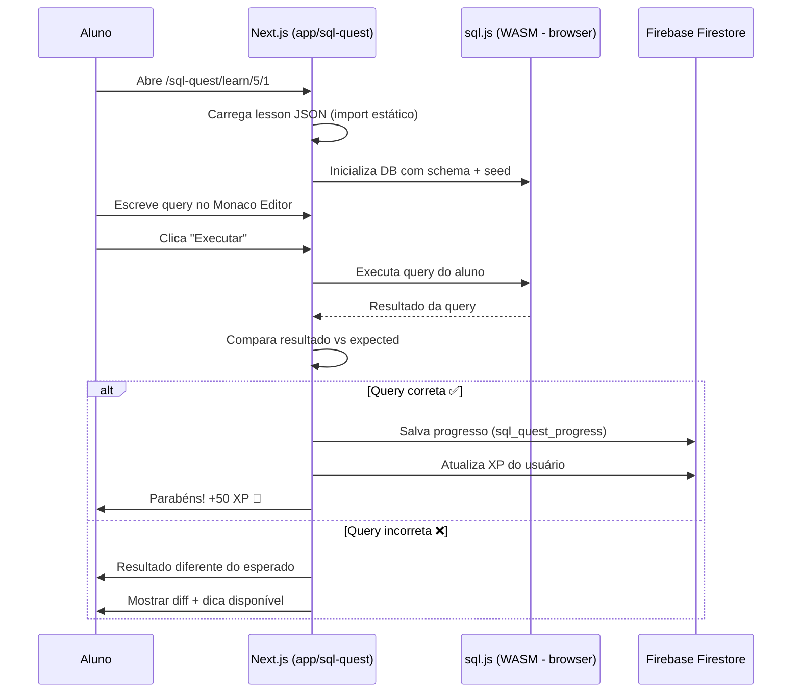

# 🗄️ SQL Quest — Plataforma de Prática com SQL

> Módulo interativo e gamificado para aprendizado de SQL, integrado ao **SENAI Games Hub**.
> Inspirado no [Boot.dev](https://boot.dev) — foco 100% em **prática hands-on**.

---

## 📌 Visão Geral

A **SQL Quest** é um módulo dentro do projeto SteamGameHub (SENAI Games Hub) onde o aluno progride por capítulos e lições resolvendo desafios de SQL diretamente no navegador. Cada lição apresenta um cenário com tabelas pré-populadas, um objetivo claro e um editor SQL integrado.

### Por que dentro do SteamGameHub?

| Vantagem | Detalhe |
|---|---|
| **Mesmo domínio** | Rota `/sql-quest` no domínio já configurado na Vercel |
| **Mesmo Firebase** | Firestore e Auth já configurados e rodando |
| **Mesma autenticação** | Alunos já cadastrados podem usar diretamente |
| **Mesma infraestrutura** | Vercel (região `gru1` - SP), sem custo extra de hosting |
| **Mesmo projeto** | Padrão já usado: `atividade-mathquest`, `simulado-saep`, etc. |

### Princípios

| Princípio | Descrição |
|---|---|
| **Prática acima de teoria** | Cada conceito é ensinado com exercícios práticos imediatos |
| **Luta produtiva** | Dificuldade gradual que desafia sem frustrar |
| **Feedback instantâneo** | Execução e validação em tempo real no browser |
| **Gamificação** | XP, streaks, conquistas e rankings para manter engajamento |
| **Currículo estruturado** | Progressão linear com desbloqueio de capítulos |

---

## 🎮 Features Principais

### 1. Editor SQL no Browser
- Editor de código com syntax highlighting (CodeMirror / Monaco Editor)
- Autocomplete para palavras-chave SQL, tabelas e colunas
- Execução de queries em tempo real usando **SQLite via WebAssembly (sql.js)**
- Sem necessidade de instalar banco de dados local
- 100% client-side — zero risco de segurança no servidor

### 2. Sistema de Lições
- Cada lição contém:
  - 📖 **Explicação breve** do conceito (texto + exemplos)
  - 🎯 **Objetivo** — o que a query deve retornar
  - 📊 **Schema visual** — diagrama das tabelas disponíveis
  - ✏️ **Editor** — onde o aluno escreve a query
  - ✅ **Validação** — comparação do resultado com o esperado
  - 💡 **Dicas** — liberadas progressivamente se o aluno travar

### 3. Gamificação
- **XP (Experiência):** Ganhos por lição concluída, bonus por acertar de primeira
- **Streaks:** Dias consecutivos de prática
- **Conquistas/Badges:** Marcos especiais (ex: "Primeira JOIN", "100 queries executadas")
- **Ranking:** Leaderboard semanal entre alunos
- **Nível do Perfil:** Evolução visual do perfil

### 4. Assistente IA (Mentor SQL)
- Chatbot integrado usando abordagem **Socrática**
- Não dá respostas diretas — guia o aluno com perguntas
- Analisa a query do aluno e aponta onde está o erro lógico
- Sugere caminhos de investigação

### 5. Sandbox Livre
- Área de prática livre onde o aluno pode:
  - Criar suas próprias tabelas
  - Importar datasets (CSV)
  - Experimentar queries sem restrições
  - Salvar e compartilhar snippets

---

## 📚 Currículo — Capítulos e Lições

### Capítulo 1: Introdução ao SQL
> Entendendo o que é SQL, bancos de dados e tabelas

| # | Lição | Conceito |
|---|---|---|
| 1.1 | O que é um Banco de Dados? | Conceitos fundamentais |
| 1.2 | Sua Primeira Query | `SELECT * FROM tabela` |
| 1.3 | Selecionando Colunas | `SELECT col1, col2` |
| 1.4 | Alias de Colunas | `AS` |
| 1.5 | Comentários em SQL | `--` e `/* */` |

---

### Capítulo 2: Criando Tabelas
> Estruturando dados do zero

| # | Lição | Conceito |
|---|---|---|
| 2.1 | CREATE TABLE | Sintaxe básica |
| 2.2 | Tipos de Dados | `INTEGER`, `TEXT`, `REAL`, `BLOB` |
| 2.3 | Valores Padrão | `DEFAULT` |
| 2.4 | Deletando Tabelas | `DROP TABLE` |
| 2.5 | Alterando Tabelas | `ALTER TABLE` |

---

### Capítulo 3: Constraints (Restrições)
> Garantindo integridade dos dados

| # | Lição | Conceito |
|---|---|---|
| 3.1 | NOT NULL | Campos obrigatórios |
| 3.2 | UNIQUE | Valores únicos |
| 3.3 | PRIMARY KEY | Identificador único |
| 3.4 | FOREIGN KEY | Relacionamentos entre tabelas |
| 3.5 | CHECK | Validações customizadas |
| 3.6 | AUTOINCREMENT | IDs automáticos |

---

### Capítulo 4: CRUD — Manipulação de Dados
> Create, Read, Update, Delete

| # | Lição | Conceito |
|---|---|---|
| 4.1 | INSERT INTO | Inserindo registros |
| 4.2 | INSERT Múltiplo | Vários registros de uma vez |
| 4.3 | UPDATE | Atualizando dados |
| 4.4 | DELETE | Removendo registros |
| 4.5 | UPSERT | `INSERT OR REPLACE` |

---

### Capítulo 5: Consultas Básicas
> Filtrando e buscando dados

| # | Lição | Conceito |
|---|---|---|
| 5.1 | WHERE | Filtrando resultados |
| 5.2 | Operadores de Comparação | `=`, `!=`, `<`, `>`, `<=`, `>=` |
| 5.3 | AND / OR | Combinando condições |
| 5.4 | IN | Lista de valores |
| 5.5 | BETWEEN | Intervalos |
| 5.6 | LIKE | Busca por padrão |
| 5.7 | IS NULL / IS NOT NULL | Tratando valores nulos |
| 5.8 | DISTINCT | Valores únicos |

---

### Capítulo 6: Ordenação e Limitação
> Estruturando resultados

| # | Lição | Conceito |
|---|---|---|
| 6.1 | ORDER BY | Ordenação ascendente/descendente |
| 6.2 | LIMIT | Limitando resultados |
| 6.3 | OFFSET | Paginação |
| 6.4 | CASE WHEN | Lógica condicional |

---

### Capítulo 7: Funções de Agregação
> Calculando sobre conjuntos de dados

| # | Lição | Conceito |
|---|---|---|
| 7.1 | COUNT | Contando registros |
| 7.2 | SUM | Somando valores |
| 7.3 | AVG | Média |
| 7.4 | MIN / MAX | Mínimo e máximo |
| 7.5 | GROUP BY | Agrupando resultados |
| 7.6 | HAVING | Filtrando grupos |

---

### Capítulo 8: Subqueries
> Queries dentro de queries

| # | Lição | Conceito |
|---|---|---|
| 8.1 | Subquery no WHERE | Filtro dinâmico |
| 8.2 | Subquery no FROM | Tabelas derivadas |
| 8.3 | Subquery no SELECT | Colunas calculadas |
| 8.4 | EXISTS / NOT EXISTS | Verificação de existência |
| 8.5 | Subqueries Correlacionadas | Referência à query externa |

---

### Capítulo 9: Normalização
> Organizando dados de forma eficiente

| # | Lição | Conceito |
|---|---|---|
| 9.1 | O que é Normalização? | Conceito e importância |
| 9.2 | 1ª Forma Normal (1NF) | Atomicidade |
| 9.3 | 2ª Forma Normal (2NF) | Dependência funcional |
| 9.4 | 3ª Forma Normal (3NF) | Dependência transitiva |
| 9.5 | Desnormalização | Quando quebrar as regras |

---

### Capítulo 10: JOINs
> Combinando dados de múltiplas tabelas

| # | Lição | Conceito |
|---|---|---|
| 10.1 | INNER JOIN | Interseção de tabelas |
| 10.2 | LEFT JOIN | Todos da esquerda + matches |
| 10.3 | RIGHT JOIN | Todos da direita + matches |
| 10.4 | FULL OUTER JOIN | União completa |
| 10.5 | CROSS JOIN | Produto cartesiano |
| 10.6 | SELF JOIN | Tabela consigo mesma |
| 10.7 | JOIN com múltiplas tabelas | Queries complexas |

---

### Capítulo 11: Performance e Otimização
> Bancos de dados rápidos em produção

| # | Lição | Conceito |
|---|---|---|
| 11.1 | Índices | `CREATE INDEX` |
| 11.2 | EXPLAIN / EXPLAIN QUERY PLAN | Analisando performance |
| 11.3 | Quando usar índices | Trade-offs |
| 11.4 | Views | Queries reutilizáveis |
| 11.5 | Transações | `BEGIN`, `COMMIT`, `ROLLBACK` |
| 11.6 | Boas práticas | Padrões de produção |

---

### Capítulo 12: Desafios Finais 🏆
> Projetos práticos que simulam cenários reais

| # | Desafio | Cenário |
|---|---|---|
| 12.1 | Sistema de E-commerce | Pedidos, produtos, clientes |
| 12.2 | Rede Social | Usuários, posts, likes, seguidores |
| 12.3 | Sistema Escolar | Alunos, turmas, notas, professores |
| 12.4 | Dashboard de Vendas | Relatórios e métricas agregadas |
| 12.5 | Projeto Final Livre | O aluno cria seu próprio schema |

---

## 🏗️ Arquitetura Técnica

### Stack — Integrada ao Projeto Existente

```
┌─────────────────────────────────────────────────────┐
│                  FRONTEND (já existe)                │
│                                                      │
│  Next.js 14 (App Router) — app/sql-quest/           │
│  ├── TypeScript (já configurado)                     │
│  ├── Tailwind CSS (já configurado)                   │
│  ├── Monaco Editor (NOVO — editor SQL)               │
│  ├── sql.js (NOVO — SQLite via WASM, client-side)    │
│  └── Lucide React (já no projeto — ícones)           │
│                                                      │
├─────────────────────────────────────────────────────┤
│                  BACKEND (já existe)                 │
│                                                      │
│  Next.js API Routes — app/api/sql-quest/            │
│  ├── Autenticação (já existe — lib/auth.ts)          │
│  ├── Progresso do aluno (NOVO)                       │
│  ├── Sistema de XP e Gamificação (NOVO)              │
│  └── API de Lições (NOVO — conteúdo em JSON)         │
│                                                      │
├─────────────────────────────────────────────────────┤
│                 DATABASE (já existe)                 │
│                                                      │
│  Firebase Firestore (mesmo projeto)                  │
│  ├── Coleção: sql_quest_progress                     │
│  ├── Coleção: sql_quest_achievements                 │
│  ├── Coleção: sql_quest_saved_queries                │
│  └── Auth: mesmos usuários já cadastrados            │
│                                                      │
├─────────────────────────────────────────────────────┤
│               EXECUÇÃO SQL (NOVO)                    │
│                                                      │
│  sql.js (client-side, WebAssembly)                   │
│  ├── Execução 100% no browser do aluno               │
│  ├── Sem risco de segurança no Firebase              │
│  └── Databases temporários por lição                 │
│                                                      │
├─────────────────────────────────────────────────────┤
│                HOSTING (já existe)                   │
│                                                      │
│  Vercel — região gru1 (São Paulo)                    │
│  ├── Mesmo domínio: seudominio.vercel.app/sql-quest  │
│  ├── Mesmo projeto na Vercel                         │
│  └── Zero custo adicional de infra                   │
│                                                      │
└─────────────────────────────────────────────────────┘
```

### Dependências Novas (a adicionar no package.json)

```json
{
  "dependencies": {
    "sql.js": "^1.10.0",
    "@monaco-editor/react": "^4.6.0"
  }
}
```

> **Nota:** Todas as outras dependências (Next.js, React, Tailwind, Firebase, Lucide, etc.) já existem no projeto.

### Fluxo de uma Lição



---

## 📁 Estrutura de Pastas (dentro do projeto existente)

```
website_SteamGameHub/
├── app/
│   ├── sql-quest/                          # ← NOVA ROTA
│   │   ├── page.tsx                        # Landing/hub do SQL Quest
│   │   ├── layout.tsx                      # Layout específico do módulo
│   │   ├── learn/
│   │   │   ├── page.tsx                    # Lista de capítulos
│   │   │   └── [chapter]/
│   │   │       ├── page.tsx                # Lista de lições do capítulo
│   │   │       └── [lesson]/
│   │   │           └── page.tsx            # Página da lição com editor
│   │   ├── sandbox/
│   │   │   └── page.tsx                    # Prática livre
│   │   ├── leaderboard/
│   │   │   └── page.tsx                    # Rankings
│   │   └── profile/
│   │       └── page.tsx                    # Progresso e conquistas
│   │
│   ├── api/
│   │   └── sql-quest/                      # ← NOVAS APIs
│   │       ├── progress/
│   │       │   └── route.ts                # Salvar/buscar progresso
│   │       ├── achievements/
│   │       │   └── route.ts                # Conquistas
│   │       └── leaderboard/
│   │           └── route.ts                # Rankings
│   │
│   ├── atividade-mathquest/                # (já existe)
│   ├── simulado-saep/                      # (já existe)
│   └── ...
│
├── components/
│   └── sql-quest/                          # ← NOVOS COMPONENTES
│       ├── SQLEditor.tsx                   # Monaco Editor configurado
│       ├── ResultTable.tsx                 # Tabela de resultados
│       ├── SchemaViewer.tsx                # Visualização do schema
│       ├── QueryRunner.tsx                 # Botão de execução + validação
│       ├── LessonContent.tsx               # Conteúdo da lição (MDX/texto)
│       ├── HintSystem.tsx                  # Dicas progressivas
│       ├── ProgressTracker.tsx             # Barra de progresso
│       ├── XPBar.tsx                       # Barra de experiência
│       ├── StreakCounter.tsx               # Contador de streak
│       └── AchievementBadge.tsx            # Badges de conquista
│
├── data/
│   └── sql-quest/                          # ← CONTEÚDO DAS LIÇÕES
│       ├── chapters.json                   # Metadados dos capítulos
│       ├── chapter-01/
│       │   ├── lesson-01.json              # { schema, seed, expected, hints }
│       │   ├── lesson-02.json
│       │   └── ...
│       ├── chapter-02/
│       └── ...
│
├── lib/
│   ├── sql-quest/                          # ← NOVA LIB
│   │   ├── sql-engine.ts                   # Wrapper do sql.js
│   │   ├── validator.ts                    # Validação de resultados
│   │   ├── xp-calculator.ts               # Cálculo de XP
│   │   └── achievements.ts                # Lógica de conquistas
│   ├── firebase/                           # (já existe)
│   └── ...
│
├── firestore.rules                         # ← ATUALIZAR com regras sql_quest
└── ...
```

---

## 🔥 Firestore — Coleções Novas

### Regras (adicionar ao `firestore.rules`)

```javascript
// ==========================================
// COLEÇÕES SQL QUEST
// ==========================================

// Progresso do aluno nas lições
match /sql_quest_progress/{progressId} {
  allow read: if request.auth != null
    && resource.data.userId == request.auth.uid;
  allow create: if request.auth != null
    && request.resource.data.userId == request.auth.uid;
  allow update: if request.auth != null
    && resource.data.userId == request.auth.uid;
  allow delete: if false;
}

// Conquistas disponíveis (metadata)
match /sql_quest_achievements/{achievementId} {
  allow read: if true;
  allow write: if false; // Gerenciado via Admin SDK
}

// Conquistas desbloqueadas pelo aluno
match /sql_quest_user_achievements/{docId} {
  allow read: if true; // Ranking público
  allow create: if request.auth != null;
  allow update, delete: if false;
}

// Queries salvas no Sandbox
match /sql_quest_saved_queries/{queryId} {
  allow read: if resource.data.isPublic == true
    || (request.auth != null && resource.data.userId == request.auth.uid);
  allow create: if request.auth != null;
  allow update, delete: if request.auth != null
    && resource.data.userId == request.auth.uid;
}
```

### Estrutura dos Documentos

```typescript
// sql_quest_progress/{progressId}
interface LessonProgress {
  userId: string;          // Firebase Auth UID
  chapterNumber: number;
  lessonNumber: number;
  status: 'locked' | 'unlocked' | 'completed';
  xpEarned: number;
  attempts: number;
  bestQuery: string;       // Melhor query do aluno
  completedAt: Timestamp | null;
  updatedAt: Timestamp;
}

// sql_quest_user_achievements/{docId}
interface UserAchievement {
  userId: string;
  achievementId: string;
  earnedAt: Timestamp;
}

// sql_quest_saved_queries/{queryId}
interface SavedQuery {
  userId: string;
  title: string;
  queryText: string;
  description: string;
  isPublic: boolean;
  createdAt: Timestamp;
}

// Dados do usuário (campo novo no user existente ou subcoleção)
interface SQLQuestProfile {
  totalXp: number;
  currentStreak: number;
  maxStreak: number;
  lastActiveDate: string;  // 'YYYY-MM-DD'
  lessonsCompleted: number;
  level: number;
}
```

---

## 📊 Formato das Lições (JSON)

Cada lição é um arquivo JSON em `data/sql-quest/chapter-XX/lesson-XX.json`:

```json
{
  "id": "5-1",
  "chapter": 5,
  "lesson": 1,
  "title": "WHERE — Filtrando Resultados",
  "description": "Aprenda a usar a cláusula WHERE para filtrar linhas da tabela.",
  "difficulty": "easy",
  "xpReward": 50,
  "content": {
    "explanation": "A cláusula `WHERE` é usada para filtrar registros...",
    "example": {
      "query": "SELECT * FROM users WHERE age > 18;",
      "description": "Retorna apenas usuários maiores de 18 anos"
    }
  },
  "schema": [
    {
      "tableName": "users",
      "columns": [
        { "name": "id", "type": "INTEGER", "primaryKey": true },
        { "name": "name", "type": "TEXT" },
        { "name": "age", "type": "INTEGER" },
        { "name": "city", "type": "TEXT" }
      ]
    }
  ],
  "seedSQL": "INSERT INTO users VALUES (1, 'Ana', 25, 'São Paulo'); INSERT INTO users VALUES (2, 'Bruno', 17, 'Rio'); INSERT INTO users VALUES (3, 'João', 30, 'Curitiba'); INSERT INTO users VALUES (4, 'Maria', 15, 'Salvador');",
  "challenge": {
    "instruction": "Selecione todos os usuários com idade maior que 21.",
    "expectedResult": {
      "columns": ["id", "name", "age", "city"],
      "rows": [
        [1, "Ana", 25, "São Paulo"],
        [3, "João", 30, "Curitiba"]
      ]
    },
    "validationMode": "exact"
  },
  "hints": [
    "Use a cláusula WHERE para filtrar resultados",
    "O operador > significa 'maior que'",
    "SELECT * FROM users WHERE age > 21;"
  ]
}
```

---

## 🎨 Design & UX

### Paleta de Cores

| Elemento | Cor | Hex |
|---|---|---|
| Background principal | Dark Navy | `#0F172A` |
| Background cards | Slate Dark | `#1E293B` |
| Accent primário | Electric Blue | `#3B82F6` |
| Accent secundário | Emerald | `#10B981` |
| Sucesso | Green | `#22C55E` |
| Erro | Red | `#EF4444` |
| Texto principal | White | `#F8FAFC` |
| Texto secundário | Slate | `#94A3B8` |

### Layout da Lição (Split View)

```
┌──────────────────────────────────────────────────┐
│  📖 SQL Quest    Cap.5 > Lição 1    🔥 5 dias   │
├─────────────────────┬────────────────────────────┤
│                     │                            │
│  CONTEÚDO           │  EDITOR SQL                │
│                     │                            │
│  ## WHERE           │  ┌────────────────────┐    │
│                     │  │ SELECT *            │    │
│  A cláusula WHERE   │  │ FROM users          │    │
│  permite filtrar    │  │ WHERE age > 18;     │    │
│  resultados...      │  │                     │    │
│                     │  └────────────────────┘    │
│  ### Exemplo:       │                            │
│  ```sql             │  [▶ Executar]  [💡 Dica]   │
│  SELECT * FROM      │                            │
│  users              │  ┌────────────────────┐    │
│  WHERE age > 18;    │  │ RESULTADO           │    │
│  ```                │  │ ┌──┬──────┬─────┐  │    │
│                     │  │ │id│ name │ age │  │    │
│  ### Sua vez!       │  │ ├──┼──────┼─────┤  │    │
│  Selecione todos    │  │ │1 │ Ana  │ 25  │  │    │
│  os usuários com    │  │ │3 │ João │ 30  │  │    │
│  idade maior que 21 │  │ └──┴──────┴─────┘  │    │
│                     │  └────────────────────┘    │
├─────────────────────┴────────────────────────────┤
│  ◀ Anterior          Progresso: ████░░ 60%  ▶    │
└──────────────────────────────────────────────────┘
```

---

## 🚀 Roadmap

### Fase 1 — MVP (4-6 semanas)
- [ ] Rota `/sql-quest` com landing page do módulo
- [ ] Navegação entre capítulos e lições
- [ ] Capítulos 1-4 com lições funcionais (JSONs)
- [ ] Editor SQL (Monaco Editor) com execução via sql.js
- [ ] Validação automática de resultados
- [ ] Progresso salvo no Firestore
- [ ] Regras do Firestore atualizadas

### Fase 2 — Gamificação (2-3 semanas)
- [ ] Sistema de XP com cálculo por lição
- [ ] Streaks diários (dias consecutivos)
- [ ] Conquistas/Badges desbloqueáveis
- [ ] Leaderboard entre alunos

### Fase 3 — Conteúdo Completo (3-4 semanas)
- [ ] Capítulos 5-11 (JSONs das lições)
- [ ] Desafios finais (Capítulo 12)
- [ ] Sistema de dicas progressivas
- [ ] Schema viewer visual (diagrama ER)

### Fase 4 — Recursos Avançados (4-6 semanas)
- [ ] Sandbox livre (criar tabelas, importar CSV)
- [ ] Assistente IA (Mentor SQL socrático)
- [ ] Salvar e compartilhar queries
- [ ] Responsividade mobile

### Fase 5 — Escala (contínuo)
- [ ] Suporte a mais dialetos SQL (PostgreSQL, MySQL)
- [ ] Desafios criados pela comunidade/professor
- [ ] Certificados de conclusão
- [ ] Internacionalização (PT-BR / EN)

---

## 💰 Custo de Infraestrutura

| Recurso | Custo | Observação |
|---|---|---|
| Vercel (hosting) | **$0** | Já pago / tier gratuito |
| Firebase Auth | **$0** | Já configurado, mesmos usuários |
| Firestore | **$0 ~ baixo** | Free tier: 50k leituras/dia, 20k escritas/dia |
| sql.js (WASM) | **$0** | Executa no browser, zero custo de servidor |
| Monaco Editor | **$0** | Open source (MIT) |
| **Total** | **$0** | Sem custo adicional na fase MVP |

> **Nota sobre Firestore:** O progresso é salvo apenas quando o aluno completa uma lição (1 escrita). Leituras acontecem ao carregar o dashboard. Com turmas de ~30 alunos, o free tier do Firestore é mais que suficiente.

---

## 📝 Notas Técnicas

- **Execução client-side:** `sql.js` (SQLite compilado para WASM) roda inteiramente no browser. O Firebase/Firestore NÃO executa queries SQL dos alunos — só armazena progresso e dados de gamificação.
- **Conteúdo como dados:** Lições são arquivos JSON estáticos importados pelo Next.js. Sem necessidade de API para servir conteúdo.
- **Segurança:** Nenhuma query do aluno chega ao servidor. O Firestore tem regras que garantem que cada aluno só acessa seus próprios dados.
- **Consistência com o projeto:** Segue os mesmos padrões de `atividade-mathquest` e `simulado-saep` — rota dedicada, componentes isolados, dados no Firestore.
- **Inspiração:** Boot.dev, SQLBolt, W3Schools SQL, HackerRank SQL, LeetCode Database.

---

> **Status:** 📋 Planejamento
> **Projeto:** SENAI Games Hub (website_SteamGameHub)
> **Rota:** `/sql-quest`
> **Autor:** Lucas Silva
> **Data:** Setembro 2026
> **Licença:** MIT
